# DITING 1.2.4 版本升级问题排查与修复实施方案

本文档针对用户从 1.2.1 版本升级至 1.2.4 版本后反馈的两大核心问题进行根因剖析，并制定具体的代码级修复实施方案。

---

## 一、问题背景与现状综述

| 问题序号 | 问题表现 | 严重级别 | 影响范围 |
| :--- | :--- | :--- | :--- |
| **问题 1** | 从 1.2.1 升级到 1.2.4 后，经典 QQ 农场的部分规则出现兼容性问题：启用其中一两个规则时，有一定概率无法正常进入游戏（卡在加载/初始化页面），必须禁用所有规则才能进入；而在 1.2.1 中即使启用多个规则也可以正常进入。 | **高**（业务阻断） | 规则拦截场景、腾讯系游戏/SDK 网络栈 |
| **问题 2** | 升级到 1.2.4 后，打开软件首页直接出现假死，随后闪退；重新打开进入“崩溃日志”页面后显示“暂无崩溃日志”。 | **严重**（冷启动崩溃） | 老用户版本升级、弱网/多网卡设备 |

> **版本发布机制与提交边界说明**：  
> 本项目的发版流程是先完成所有功能/缺陷代码提交，最后统一打版本号提交并发布。
> - `5628cd8`：发布 1.2.1 版本
> - `8561714`：发布 1.2.2 版本（三模式完全数据物理隔离）
> - `06a2989`：发布 1.2.3 版本（工作模式切换与动画无缝过渡）
> - `51eb473`：发布 1.2.4 版本（三模式统一权限管理与就绪新手向导）
> - 1.2.4 发布后补充提交：`a4c8b23`（修复网络诊断页 ViewModel 构造缺失）、`013c8de`（修复极速模式拦截日志订阅ID为空）
> - 核心底层 Go 隧道（`Android/tunnel/`）自 1.2.1 至今**零变动**，问题完全集中在 Android 上层（Kotlin / Compose / DNS 规则应答报文构建 / 生命周期流程）。

---

## 二、根因深度剖析

```mermaid
flowchart TD
    subgraph Issue2["问题 2：首页假死闪退无日志"]
        A1["老用户本地无 isOnboardingCompleted 标记"] --> B1["MainActivity 误判为未就绪新手，唤起 ModeOnboardingActivity"]
        B1 --> C1["MainActivity.onCreate 漏写 return"]
        C1 --> D1["MainActivity 继续 setContent 构建 MainScreen / HorizontalPager / 数据库预热"]
        B1 --> E1["ModeOnboardingActivity 在主线程执行 NetworkInfoProbe IPC 与应用枚举"]
        D1 & E1 --> F1["双全屏 Activity Compose 树与重度 IPC 在冷启动主线程激烈竞争"]
        F1 --> G1["主线程卡死超过 5 秒触发系统 ANR"]
        G1 --> H1["Android 系统底层发送 SIGQUIT / SIGKILL 强制杀进程"]
        H1 --> I1["非 JVM 异常，UncaughtExceptionHandler 未触发，崩溃日志为空"]
    end

    subgraph Issue1["问题 1：QQ 农场规则兼容性问题"]
        J1["1.2.3 提交 cc4af10 将默认日志模式调整为 ALL"] --> K1["游戏启动瞬间并发数十个 DNS 请求，被拦截域名频繁写库引发锁竞争与丢包"]
        L1["ExpressDnsMessageUtils 构建 NXDOMAIN 时伪造了非法的 Authority SOA 记录"] --> M1["SOA 的 Primary Master 与 Host 填入了被查询的子域名（违背 RFC 1035）"]
        M1 --> N1["腾讯 MSDK / 游戏网络库容错较差，遇到格式不规范 SOA 陷入重试风暴或解析挂起"]
        K1 & N1 --> O1["启用规则卡在游戏加载页；禁用所有规则走真实上游合法报文，正常进入"]
    end
```



### 2.1 首页假死随后闪退且无崩溃日志（问题 2）

1. **老用户升级兼容性标记缺失**：
   - 1.2.4 在提交 `3ab425b` 引入了 `ModePermissionStore.isOnboardingCompleted`。
   - 老用户本地已同意协议（`isInitialAgreementAccepted = true`）且已配置模式（`hasSelectedWorkMode = true`），但老用户升级后本地没有 `isOnboardingCompleted` 键值，调用默认返回 `false`，导致系统将老用户误判定为“未完成新手向导的新用户”。
2. **`MainActivity.onCreate` 唤起向导后缺少 `return`（致命生命周期漏洞）**：
   - 在 `MainActivity.kt` 中，判断老用户未完成向导后调用了 `ModeOnboardingActivity.start(this, currentWorkMode, isFirstLaunch = true)`。
   - 唤起向导后没有 `return`，MainActivity 紧接着在当前主线程继续执行全套 `setContent`（构建 `MainScreen`、预加载 3 个页面的 `HorizontalPager`、实例化所有 ViewModel、触发 `initializeAcceptedExperience` 及数据库预热）。
3. **向导 Activity 主线程高耗时跨进程 IPC 阻塞**：
   - 与此同时，被启动的 `ModeOnboardingActivity.onCreate` 也在主线程中同步执行：
     - `NetworkInfoProbe.probe(this)`（通过 Binder 跨进程遍历系统所有网络接口与 LinkProperties）；
     - `refreshPermissionStates()` 遍历各权限，在检查应用列表权限时触发 `pm.getInstalledApplications(0)`，主线程序列化整机数百个应用包信息；
     - 并在主线程解析自身复杂 Compose 视图树与动画。
4. **主线程严重 ANR 触发系统 SIGKILL 强杀**：
   - 两个全屏 Activity 及其 Compose 树、重度系统 IPC 和数据库初始化在主线程同时并发执行，UI 线程严重超时阻塞超过 5 秒，系统判定 ANR 后直接强杀闪退。
   - 因为是操作系统内核直接发送 `SIGKILL` 杀死进程，根本没有抛出 JVM 未捕获异常，`CrashLogManager`（`Thread.UncaughtExceptionHandler`）完全无法截获，因此崩溃日志页面显示“暂无崩溃日志”。

### 2.2 经典 QQ 农场规则兼容性问题（问题 1）

1. **阻断应答伪造非法 SOA 记录导致游戏 SDK 解析异常**：
   - 在 1.2.1 中底层 Go 隧道构建的 NXDOMAIN 响应为标准的无 SOA 响应；
   - 在 1.2.2 ~ 1.2.4 改造中，极速模式引擎及上层工具（`ExpressDnsMessageUtils.kt` / `DnsMessageUtils.kt`）在生成阻断（NXDOMAIN / NODATA）报文时，强行在 Authority Section 写入了一条伪造的 SOA 记录（`authorityCount = 1`），且该 SOA 的 Primary Master 与 Host 字段直接填入了被查询的子域名自身（违背了 RFC 1035 / RFC 2308 规范）。
   - QQ 农场内嵌的腾讯 MSDK / 游戏网络库在收到此类不合规的 SOA NXDOMAIN 报文时，容错性差，无法立即识别为无记录，而是触发了超时等待或死循环重试；而当禁用规则时，DNS 请求直达公共上游返回合法报文，游戏得以正常进入。
2. **默认日志策略由静默变为全量记录（提交 `cc4af10`）**：
   - 1.2.3 提交 `cc4af10` 将默认日志记录策略统一变更为 `DnsLogMode.ALL`（记录全部日志）。
   - QQ 农场在进入加载阶段时会突发并发数十个 DNS 请求（涵盖 Midas 支付、Beacon 统计、GCloud、各类 CDN）。被拦截的域名在并发突发下频繁触发协程异步写入 Room 数据库，引发写锁竞争与高并发通信丢包。

---

## 三、修复实施方案与设计

### 3.1 问题 2 治理方案（首页假死与生命周期治理）

#### 治理点 1：老用户升级平滑迁移
在 `MainActivity.onCreate` 最前置位置，检查若用户满足：
```kotlin
val isExistingUser = SystemSettingsStore.isInitialAgreementAccepted(this) && hasSelectedWorkMode
```
说明该用户是从 1.2.1 ~ 1.2.3 升级而来的老用户。老用户已正常使用过软件，**坚决不应再次强制唤起新手向导**。
自动为老用户将当前模式及所有模式标记为向导已完成：
```kotlin
if (isExistingUser && !ModePermissionStore.isOnboardingCompleted(this, currentWorkMode)) {
    ModePermissionStore.setOnboardingCompleted(this, currentWorkMode, true)
}
```

#### 治理点 2：补充漏写的生命周期 `return`
在 `MainActivity.onCreate` 中，无论是跳转 `WorkModeActivity.start(...)` 还是 `ModeOnboardingActivity.start(...)`，紧随其后必须显式调用 `return`：
```kotlin
if (SystemSettingsStore.isInitialAgreementAccepted(this) && !hasSelectedWorkMode) {
    WorkModeActivity.start(this, isFirstLaunch = true)
    return
} else if (SystemSettingsStore.isInitialAgreementAccepted(this) &&
    !com.haoze.diting.permission.ModePermissionStore.isOnboardingCompleted(this, currentWorkMode)
) {
    com.haoze.diting.onboarding.ModeOnboardingActivity.start(this, currentWorkMode, isFirstLaunch = true)
    return
}
```
彻底杜绝在新 Activity 启动时，MainActivity 仍在后台主线程继续执行 `setContent` 与全套初始化。

#### 治理点 3：向导 Activity 异步化改造
1. 将 `ModeOnboardingActivity.onCreate` 中的网络探测 `NetworkInfoProbe.probe(this)` 移出主线程，采用协程在 IO 线程异步探测后更新状态，严禁阻塞 `onCreate`。
2. 避免在 `refreshPermissionStates` 中同步调用 `pm.getInstalledApplications(0)`，改用仅在用户显式触发应用列表权限流程时异步探测。

---

## 四、问题 1 治理方案（DNS 阻断响应与高并发优化）

#### 治理点 1：规范化 DNS 阻断响应报文（移除伪造的非法 SOA 记录）
对齐底层 Go 隧道行为与 RFC 1035 / RFC 2308 规范：
1. 检查并修改 `ExpressDnsMessageUtils.kt` 与 `DnsMessageUtils.kt` 中的 `buildBlockedResponse`。
2. 当拦截规则返回 NXDOMAIN（域名不存在）或 NODATA 时：
   - 将报文 Flags 设置为标准的 `0x8183`（Response, Recursion Desired, Recursion Available, RCODE = NXDOMAIN）；
   - 将 `anCount = 0`，`nsCount = 0`，`arCount = 0`；
   - **严禁强行塞入不合法的伪造子域名 SOA 记录**；
   - 保持只保留 Question 部分的标准应答，确保所有第三方网络库与游戏 SDK 均可无缝兼容。
3. 当拦截规则模式为 `0.0.0.0` 时，保持标准 A 记录写入，提供更快速的连接拒绝（`ECONNREFUSED`），跳过无用组件。

#### 治理点 2：高并发拦截日志写入防抖与背压保护
1. 检查 `DnsLogRepository` / `DnsLogger` 的写入机制，确保在游戏突发并发大量解析与阻断时，通过异步 Channel 或并发限流机制处理，确保即使在 `DnsLogMode.ALL` 下，也不会因为数据库批量事务排队阻塞主 DNS 转发或造成请求超时丢包。

---

## 五、涉及修改的文件清单与行数约束

> **代码行数强约束**：每个代码文件行数不得超过 **600 行**。  
> `MainActivity.kt` 当前已有 588 行，修改时必须精简，坚决不可突破 600 行！

| 文件路径 | 当前行数 | 预估改动 | 风险防控说明 |
| :--- | :--- | :--- | :--- |
| `Android/app/src/main/java/com/haoze/diting/MainActivity.kt` | 588 行 | 添加老用户迁移补齐逻辑，添加 2 处漏写的 `return` | 提取或精简局部多余代码，确保修改后总行数 ≤ 588 行，严守 600 行红线 |
| `Android/app/src/main/java/com/haoze/diting/onboarding/ModeOnboardingActivity.kt` | 238 行 | `NetworkInfoProbe.probe` 异步化加载 | 行数安全 |
| `Android/app/src/main/java/com/haoze/diting/permission/AppPermission.kt` | 160 行 | 优化应用列表探测时机，避免主线程 IPC 阻塞 | 行数安全 |
| `Android/app/src/main/java/com/haoze/diting/express/engine/ExpressDnsMessageUtils.kt` | 551 行 | 修正 NXDOMAIN/NODATA 阻断报文生成，移除伪造 SOA | 行数安全（≤ 555 行） |
| `Android/app/src/main/java/com/haoze/diting/vpn/DnsMessageUtils.kt` | 280 行 | 同步对齐阻断响应生成逻辑 | 行数安全 |

---

## 六、验证与测试规划

1. **单元测试回归**：运行 `./gradlew testDebugUnitTest`，确保 DNS 解析报文编解码、规则匹配、数据隔离单元测试 100% 通过。
2. **老用户升级冷启动模拟验证**：
   - 构造老用户 SharedPreferences 数据（`isInitialAgreementAccepted = true`，`hasSelectedWorkMode = true`，缺少 `isOnboardingCompleted`）；
   - 验证冷启动时自动平滑进入首页，主线程零 ANR 风险，不弹出新手向导。
3. **新用户首次安装向导验证**：
   - 清空数据启动，验证跳转向导时 `MainActivity` 立即 `return`，主线程不构建无用视图；
   - 验证向导完成后正常回切 `MainActivity`。
4. **QQ 农场规则兼容性验证**：
   - 启用 QQ 农场所涉拦截规则，验证生成的 NXDOMAIN 报文不含非法 SOA，第三方 SDK 不触发解析异常，游戏加载流程正常通过。
5. **Git 提交规划**：
   - 严格遵循 Conventional Commits 中文规范，简明准确提交修改。
