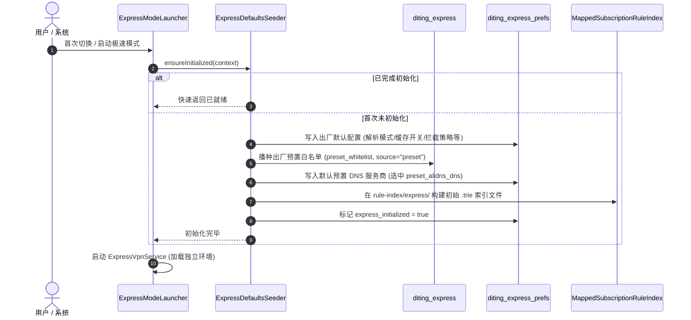

# 三模式完全数据隔离实施方案

> 状态：方案定稿稿（全新独立模式规范）  
> 关联文档：`docs/development/Archive/express-mode-architecture.md`、`docs/development/Archive/express-mode-plan.md`  
> 核心原则：三模式物理级完全隔离；极速模式作为全新独立模式，零继承、零复用已有模式用户数据，按统一出厂预设独立初始化与闭环维护。

---

## 1. 背景与目标

应用现已演进出三种并行的工作模式（`AppWorkMode`，定义于 `Android/app/src/main/java/com/haoze/diting/ui/mode/AppWorkMode.kt:11`）：

| 模式 | 枚举值 | 核心技术栈 | 运行时入口 | 定位与特性 |
| --- | --- | --- | --- | --- |
| 普通模式 | `NORMAL` | Kotlin UI + Go 隧道内核（gVisor netstack） | `DnsVpnService` | 全功能网络管控：全隧道接管、HTTPS 解密检查、应用级联网控制、出站代理与实时流量统计 |
| 服务器模式 | `DNS` | Kotlin UI + Go 独立 DNS 引擎（0.0.0.0:1053） | `DnsModeService` | 局域网独立 DNS 服务器，为局域网路由器、PC 与移动终端提供解析服务 |
| 极速模式 | `EXPRESS` | 纯 Kotlin 原生实现（无 Go 依赖、轻量窄路由 TUN） | `ExpressVpnService` | 轻量极低功耗：下潜支持至 Android 7.0，仅劫持 DNS 流量，专注于核心 DNS 加速与过滤 |

### 现存问题
当前系统的数据边界不完整：服务器模式拥有独立规则库，但**普通模式与极速模式在底层共用同一套规则数据库、规则索引文件以及大量设置项**。这导致：
1. 极速模式会直接读写普通模式的数据与配置，无法针对极速模式独立调优；
2. 清理操作跨模式相互波及（例如在极速模式下清理规则会连带清空普通模式与服务器模式的规则库）；
3. 共享索引文件在模式切换时存在并发读写风险。

### 本方案目标
1. **物理级数据完全隔离**：为三种模式各自建立并维护完全独立的规则库、运行时表、规则索引文件、DNS 缓存、运行日志与专属偏好设置。
2. **全新独立模式设计（零继承）**：极速模式作为全新独立环境，**绝不从普通模式或其它模式中继承、复用或复制任何用户已有数据（无种子迁移、无旧键回退、无升级弹窗打扰）**。
3. **统一出厂基准**：极速模式首次进入时按需初始化，加载与出厂默认规范一致的基础预设（系统预置白名单、预置 DNS 服务商、出厂默认设置），用户数据全空白起步。
4. **功能闭环自治**：配置导入导出智能安全裁剪，单项清理与模式内一键重置严格限制在当前模式数据边界之内。

---

## 2. 现状数据耦合诊断清单

经全面代码排查，当前普通模式与极速模式的核心耦合点如下：

### 2.1 规则与运行时数据库（Room）
- **文件共用**：极速模式启动时直接打开普通模式数据库 `diting_database`（`ExpressTunnelManager.kt:236`）。
- **规则表共用**：黑白名单（`block_rule`/`allow_rule`）、重写（`rewrite_rule`）、订阅（`subscription` 等）完全同表混用。
- **运行时表混淆**：DNS 缓存（`dns_cache`）、解析日志（`dns_log`）、竞速与 Bootstrap 日志（`race_log`/`bootstrap_log`）两模式混写同表，导致请求日志界面数据交叉。

### 2.2 规则索引文件（DTRI）
- **路径共用**：统一硬编码写入 `filesDir/rule-index/`（`RuleIndexLayout.kt:27-48`）。
- **并发窗口**：普通模式写入并推给 Go 引擎复读，极速模式使用纯 Kotlin mmap 读取；模式切换瞬间存在交叉读写风险。

### 2.3 偏好存储（SharedPreferences）
- 普通模式与极速模式共享超级偏好文件 `dns_vpn_prefs`：
  - `AppRulesSettingsStore`（域名规则开关、拦截响应模式、动态拦截配置等）；
  - `ResolutionSettingsStore`（解析模式、主备服务商选定）；
  - `DnsProvider`（已配置 DNS 服务商列表与当前选中项）；
  - `DnsCacheSettingsStore`（DNS 缓存策略）；
  - `SubscriptionAutoUpdateSettings`（订阅自动更新周期与开关）；
  - `SystemSettingsStore` 中的 DNS 日志模式与 IPv6 模式。
- 一个模式下的配置修改会隐式改变另一模式的网络行为。

### 2.4 跨模式波及副作用
- **清理操作全量抹除**：`DataCleanupManager.kt` 中的 `clearAllDomainRules` / `clearAllSubscriptions` 同时清空 `AppDatabase` 和 `DnsRulesDatabase`。在极速模式点击清理，普通模式和服务器模式的规则被一并清空。
- **配置导入导出越界**：极速模式导出/导入底层仍直连 `AppDatabase`，跨模式备份混淆。

---

## 3. 目标隔离架构与数据分层

系统划分为**全局配置层**与**模式独立沙箱层**：

```mermaid
graph TD
    subgraph Global [全局共享层 (不隔离)]
        G1[当前工作模式 WorkModeStore]
        G2[应用外观 / 主题 / 语言]
        G3[应用升级检测 / 隐私协议 / 引导标记]
    end

    subgraph ModeSandboxes [模式独立沙箱层 (完全物理隔离)]
        subgraph NormalMode [普通模式 NORMAL]
            NDB[(diting_database)]
            NPref[(dns_vpn_prefs)]
            NIdx[rule-index/]
            NEngine[DnsVpnService / Go]
        end

        subgraph ExpressMode [极速模式 EXPRESS]
            EDB[(diting_express)]
            EPref[(diting_express_prefs)]
            EIdx[rule-index/express/]
            EEngine[ExpressVpnService / Kotlin]
        end

        subgraph DnsMode [服务器模式 DNS]
            DDB[(diting_dns_rules)]
            DPref[(diting_dns_mode_prefs)]
            DIdx[纯内存 / 无磁盘索引]
            DEngine[DnsModeService / Go]
        end
    end
```

### 3.1 分层存储矩阵

| 模式 | 规则与运行时数据库 | 偏好配置文件 (SharedPreferences) | 规则索引文件目录 | 运行时引擎 |
| --- | --- | --- | --- | --- |
| **普通模式** | `diting_database`<br>(含 HTTPS 日志与流量统计) | `dns_vpn_prefs` | `filesDir/rule-index/` | `DnsVpnService` (Go) |
| **极速模式** | `diting_express`<br>(规则表 + 4 项运行时表) | `diting_express_prefs`<br>(独立文件，原生键名) | `filesDir/rule-index/express/` | `ExpressVpnService` (Kotlin) |
| **服务器模式** | `diting_dns_rules`<br>(维持独立规则库) | `diting_dns_mode_prefs` | *无 (纯内存)* | `DnsModeService` (Go) |

### 3.2 极速模式专有库（`diting_express`）实体定义
- **规则实体**：复用现有类，包含 `BlockRuleEntity`、`AllowRuleEntity`、`RewriteRuleEntity`、`SubscriptionEntity`、`SubscriptionGroupEntity`、`SubscriptionAutoUpdateItemEntity`、`MirrorTemplateEntity` 及其对应的 Source 表。
- **运行时实体**：独立包含 `DnsCacheEntity`、`DnsLogEntity`、`RaceLogEntity`、`BootstrapLogEntity` 及其 DAO。
- **排除实体**：物理排除 `HttpRequestLogEntity`（HTTPS 检查日志）与 `AppTrafficDailyEntity`（流量统计），极速模式轻量 TUN 引擎不支持且不需要这两类数据。

---

## 4. 关键设计决策

### D1：`RuleDataset` 核心三元化
`RuleDataset` 扩展为三元枚举（`NORMAL` / `EXPRESS` / `DNS_MODE`），作为贯穿数据层、存储层与调度层的唯一路由标识：
- `RuleDatabases.forDataset(context, dataset)`：新增 `EXPRESS -> ExpressRulesDatabase.getInstance(context)`；
- `RuleIndexLayout.rootDirectory(filesDir, dataset)`：为 EXPRESS 分配 `rule-index/express/`；
- 所有 WorkManager 调度（`RuleOperationWorker`、`SubscriptionAutoUpdateScheduler`）依据传入的 `dataset` 精准分发执行。

### D2：偏好配置采用 SharedPreferences 独立文件隔离
彻底放弃单文件内键名前缀混存的方案，为极速模式建立专属文件 `diting_express_prefs`：
- **物理隔离**：各 Store（`AppRulesSettingsStore`、`ResolutionSettingsStore`、`DnsCacheSettingsStore`、`DnsProvider` 等）通过接收 `RuleDataset` 参数，底层自动切换 `context.getSharedPreferences(prefsName, Context.MODE_PRIVATE)`；
- **键名原生纯净**：无需拼接 `ds_express_` 前缀，保持原始直观的 Key（如 `domain_rules_enabled`、`selected_provider_id`），杜绝键名污染与解析负担；
- **清理与重置彻底**：模式重置可直接清除专属偏好文件，无误伤其它模式配置的风险。

### D3：按需初始化替代种子数据迁移（零继承）
彻底剔除原方案中的“种子迁移（从普通模式复制已有数据）”设计：
- **零继承**：用户进入极速模式时，绝不读取、不复制、不继承普通模式的已有自定义规则、订阅源、自定义 DNS 与历史日志；
- **按需触发**：仅在用户首次切换到极速模式（或以极速模式冷启动）时，检查极速模式出厂状态。若未初始化，执行出厂预设播种并构建初始索引；
- **零启动损耗**：从未激活极速模式的用户设备上，不会生成任何极速模式磁盘文件，避免无谓 I/O。

### D4：运行时分发纯数据集驱动
重构 `RuntimeDnsSettingsRefresher`，彻底移除依据全局“当前 UI 模式（WorkModeStore）”分发刷新的设计缺陷，完全由调用方携带的 `RuleDataset` 决定：
- `NORMAL` → 仅在 `DnsVpnService` 运行时刷新 Go 内核；
- `EXPRESS` → 仅在 `ExpressVpnService` 运行时刷新 Kotlin 引擎；
- `DNS_MODE` → 仅在 `DnsModeService` 运行时刷新 Standalone DNS 引擎。

### D5：配置导入导出智能安全裁剪
针对极速模式设计专属导入导出逻辑：
- **导出**：在极速模式下仅导出极速模式自身的数据库与配置项；
- **导入**：当用户在极速模式下导入完整配置备份（如从普通模式导出的配置文件）时，自动执行**智能安全裁剪**——仅提取极速模式支持的域名规则、订阅源与 DNS 服务商设置，安全忽略 CA 证书、出站代理、应用黑白名单等普通模式专属配置，防止脏数据注入。

### D6：数据清理与出厂重置模式级闭环
- `DataCleanupManager` 的所有单项清理方法（清理域名规则、清理订阅、清理 DNS 缓存、清理请求日志）均引入 `dataset: RuleDataset` 参数：
  - 极速模式下的清理操作仅清空 `diting_express` 对应表、重建 `rule-index/express/` 索引，并仅刷新极速模式引擎；
  - 绝不连带修改 `AppDatabase` 或 `DnsRulesDatabase`。
- **模式内出厂重置**：极速模式设置中的“恢复默认/重置”仅重置 `diting_express` 和 `diting_express_prefs` 并重新播种出厂预设，绝不影响普通模式。

---

## 5. 极速模式出厂预设初始化规范

当极速模式被首次激活（或执行模式内恢复出厂重置）时，按如下规范建立全新的数据环境：



### 5.1 出厂预设明细

1. **预置白名单播种**：
   - 数据源：`assets/preset_whitelist.txt`；
   - 写入目标：`diting_express` 的 `allow_rule` 与 `allow_rule_source`（source = `"preset"`）；
   - 自定义规则状态：用户黑名单（`block_rule`）、用户白名单（source = `"useradd"`）、重写规则（`rewrite_rule`）均为空（0 条）。
2. **预设 DNS 服务商配置**：
   - 写入系统内置的优质公共服务商（阿里云、腾讯云 DNSPod、360、OneDNS、Cloudflare、Google 等）；
   - 默认选中项：阿里云 DNS（`preset_alidns_dns`）；
   - 自定义服务商列表：空。
3. **出厂偏好默认值（`diting_express_prefs`）**：
   - `domain_rules_enabled`：`true`（域名规则总开关默认开启）；
   - `block_response_mode`：`NXDOMAIN` 或 `REFUSED`（与普通模式出厂一致）；
   - `resolution_mode`：主备模式（`PRIMARY_BACKUP`）；
   - `dns_cache_enabled`：`true`（默认开启 DNS 缓存）；
   - `dns_log_mode`：`SUMMARY`（默认简要日志）；
   - `subscription_auto_update_enabled`：`true`（默认开启自动更新，间隔 24 小时）；
   - `ipv6_mode`：`AUTO`。
4. **规则订阅与镜像模板**：
   - 订阅源列表：空（0 条，由用户后续自主添加）；
   - 镜像模板列表：空。
5. **运行时日志与缓存**：
   - `dns_cache`、`dns_log`、`race_log`、`bootstrap_log`：全空起步，自然积累。

---

## 6. 实施计划

实施计划分为四个清晰解耦的阶段，每阶段均具备独立的编译运行与自测验证能力。

### Phase 1：数据层与配置层物理隔离基础设施

- [ ] **扩展数据集枚举**：`RuleDataset` 增加 `EXPRESS` 枚举值；`RuleDatabases` 适配三元实例解析。
- [ ] **创建极速模式独立数据库**：新增 `ExpressRulesDatabase.kt`（数据库文件名为 `diting_express`），包含规则表与 4 个运行时表，排除 HTTPS 日志与流量统计实体。
- [ ] **规则索引目录分域**：改造 `RuleIndexLayout`，增加 `dataset` 路由：`rootDirectory(filesDir, dataset)`，极速模式指向 `rule-index/express/`。
- [ ] **偏好设置 Store 支持数据集路由**：
  - 改造 `AppRulesSettingsStore`、`ResolutionSettingsStore`、`DnsCacheSettingsStore`、`DnsProvider`、`SubscriptionAutoUpdateSettings` 等模式相关 Store；
  - 增加 `dataset: RuleDataset = RuleDataset.NORMAL` 参数；
  - 极速模式路由读取独立偏好文件 `diting_express_prefs`，普通模式维持 `dns_vpn_prefs`。
- **阶段验收**：
  - 项目编译通过；
  - 单元测试验证：针对 `EXPRESS` 数据集读写 SharedPreferences 与 SQLite，与 `NORMAL` 互不干扰。

### Phase 2：出厂预设播种与运行时引擎对接

- [ ] **实现极速模式出厂预设播种器**：
  - 新建/扩展 `ExpressDefaultsSeeder`，实现 `ensureInitialized`；
  - 按规范完成 `preset_whitelist` 播种、默认 DNS 服务商预置及出厂偏好写入；
  - 生成 `rule-index/express/` 初始 trie 索引。
- [ ] **按需接入初始化流程**：在 `ExpressModeLauncher.switchToExpress` 与极速模式服务入口中挂载按需初始化检查。
- [ ] **极速引擎存储切换**：
  - 将 `ExpressTunnelManager.kt` 中硬编码的 `AppDatabase.getInstance` 与 `rule-index` 切换为 `ExpressRulesDatabase.getInstance` 与 `rule-index/express/`；
  - 运行时缓存与日志写入切换至独立库。
- [ ] **调度与刷新服务三元化**：
  - `RuntimeDnsSettingsRefresher` 改造为数据集驱动分发；
  - `SubscriptionAutoUpdateScheduler` 新增 `subscription_auto_update_express` 独立 WorkManager 定时任务。
- **阶段验收**：
  - 首次启动极速模式，自动生成 `diting_express`、`diting_express_prefs` 与 `rule-index/express/*.trie`；
  - 极速模式正常拦截与放行，运行时日志仅记录于 `diting_express`。

### Phase 3：UI 链路完全分流、导入导出裁剪与数据清理闭环

- [ ] **UI 路由全链路绑定 EXPRESS**：
  - `SettingsRouteActivity`、`LogRouteActivity`、`ExpressMainScreen`、`ExpressRuleControlScreen` 等相关页面与 ViewModel，显式传入 `RuleDataset.EXPRESS`。
- [ ] **数据清理模式级闭环**：
  - 改造 `DataCleanupManager`，所有清理函数均要求传入 `RuleDataset`；
  - 极速模式清理页面仅操作 `diting_express` 与 `rule-index/express/`，刷新仅通知 `ExpressVpnService`，彻底杜绝跨模式连带误删；
  - 极速模式下“一键清理/恢复出厂”仅重置自身并重新播种出厂预设。
- [ ] **配置导入导出智能安全裁剪**：
  - `ConfigExporter` 与 `ConfigImporter` 接入数据集参数；
  - 极速模式导入外部备份文件时，自动过滤丢弃普通模式专有特性（CA/出站代理/应用管控），仅导入通用域名规则与 DNS 配置。
- **阶段验收**：
  - 在极速模式下清空规则/订阅，核实普通模式和服务器模式数据安然无恙；
  - 导入包含全功能配置的备份文件，极速模式平稳降级接入，无报错与脏数据。

### Phase 4：全链路回归与代码规范审查

- [ ] **代码规范审查**：
  - 验证所有新增与修改的代码文件行数均不超过 600 行；
  - 检索 `com.haoze.diting.express` 包下对 `AppDatabase.getInstance` 与 `dns_vpn_prefs` 的引用，确保命中数为 0。
- [ ] **全功能独立性回归矩阵**：
  - 普通模式新增规则/订阅 → 极速模式无变化；
  - 极速模式新增规则/订阅 → 普通模式无变化；
  - 三模式各自执行规则订阅自动更新，日志与更新状态互不串门；
  - 三模式分别查看解析日志与 DNS 缓存，各显其域。

---

## 7. 风险评估与应对策略

| 潜在风险 | 影响程度 | 应对策略 |
| --- | --- | --- |
| **旧代码隐式直连 `AppDatabase`** | 高 | 在 Phase 1 完成后，利用静态脚本全工程扫描 `AppDatabase.getInstance`，对所有调用点强制进行模式归属标注，极速路径命中直接编译报错或断言拦截。 |
| **极速模式冷启动出厂初始化耗时** | 中 | 初始化仅需从 assets 读取几百行文本并插入本地 SQLite，耗时约 50~100ms；在协程中异步完成，构建初始索引并有超时保护，保障启动流畅。 |
| **独立偏好文件遗漏个别 Key** | 低 | 建立严格的 Key 审计清单，所有在极速模式 UI 展示的开关项逐一核对其在 `diting_express_prefs` 中的读写路径。 |
| **跨模式导入配置文件字段不兼容** | 中 | `ConfigImporter` 针对极速模式使用白名单策略进行字段反序列化，未识别的普通模式字段直接忽略，不抛出异常。 |

---

## 8. 代码级验收指标

1. **零残留引用**：
   - `grep -rn "AppDatabase.getInstance" Android/app/src/main/java/com/haoze/diting/express/` 结果为 0。
   - `grep -rn "dns_vpn_prefs" Android/app/src/main/java/com/haoze/diting/express/` 结果为 0。
2. **物理文件并存规范**：
   - 数据库目录：`databases/diting_database`、`databases/diting_express`、`databases/diting_dns_rules` 彼此独立并存。
   - 偏好目录：`shared_prefs/dns_vpn_prefs.xml`、`shared_prefs/diting_express_prefs.xml`、`shared_prefs/diting_dns_mode_prefs.xml` 彼此独立并存。
   - 索引目录：`files/rule-index/` 与 `files/rule-index/express/` 彼此独立并存。
3. **零跨模式连带影响**：
   - 极速模式下执行“清理全部规则与订阅”，普通模式与服务器模式中的任何数据表记录数均保持完全不变。
